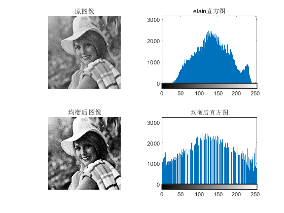
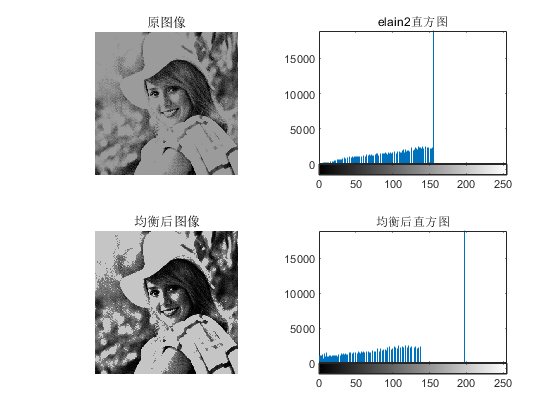

# 数字图像处理第三次作业——直方图图像增强 #

班级：自动化64 
姓名：丁鹏 
学号：2160504091 
提交日期：2019.3.17

------------------
### 摘要：本次报告共4幅原图像和10幅经变亮或者变暗处理的图像，先将附件所有的图像的直方图画了出来，对直方图有了更清晰的认识；接着根据题目要求，通过MATLAB R2018b平台对所有图像进行直方图均衡化，将处理过的图像与原图像进行对比，分析处理效果；然后利用相关指令，指定不同源图像的直方图，进行图像匹配，达到图像增强的效果；最后对elain和lena图像进行7*7的局部直方图增强，以及利用直方图算出全局阈值，对图像elain和woman进行图像分割。 ###

##### 一、把附件图像的直方图画出; #####
1. 问题分析：直方图显示不同的像素值在不同的强度值上的出现频率，直方图实现方法是对一幅灰度图像从上到下，从左到右扫描每个像素值，在每个灰度值上计算像素数目，以这些数据为基础完成图像直方图的绘制。
 
2. 处理结果：

1）. **citywall图像**

2）. **elain图像**

3）. **lena图像**

 
4）. **woman图像**

结果分析：本文分别采用imhist函数求取图像的直方图。但在处理之前，需要先把索引图像转成灰度图像。将直方图与原始图像对比可以清楚的看到图像的灰度分布与图像直方图之间的关系：在暗图像中，直方图的分量集中在灰度级的低端；亮图像的直方图分量则倾向于灰度级的高端。低对比度图像具有较窄的直方图，且集中于灰度级的中部；高对比度图像中直方图的分量覆盖了很宽的灰度级范围，而且像素的分布没有太不均匀。

##### 二、把所有图像进行直方图均衡；输出均衡后的图像和源图像进行比对；分析改善内容； #####
1. 问题分析：直方图均衡化处理的“中心思想”是把原始图像的灰度直方图从比较集中的某个灰度区间变成在全部灰度范围内的均匀分布。 
直方图均衡化的过程：  
1）列出原始图像和变换后图像的灰度级（L是灰度级的个数）；  
2）统计员图像中各灰度级的像素个数；  
3）计算原始图像直方图P(i)=Ni/N；  
4）计算累计直方图P(j)=P(1) + P(2) + P(3) +„+ P(i)；  
5）利用灰度值变换函数计算变换后的灰度值，并四舍五入取整；j=INT[(L-1)Pj+0.5]  
6）确定灰度变换关系i→j，据此将原图像的灰度值f（m,n）=i修正为g（m，n）=j；  
7）统计变换后个灰度级的像素个数Nj；  
8）计算变换后图像的直方图Pj=Nj/N； 

2. 处理结果：

1）. **citywall图像**

2）. **elain图像**

3）. **lena图像**

4）. **woman图像**

结果分析：经过处理得到若干组每组四幅图像，每组中四幅图像分别为原始图像、原始图像的直方图、直方图均衡化后的图像以及均衡化后图像的直方图。从直方图上可以观察到灰度分布确实更加均匀并且占据整个灰度级范围；从图像上可以观察到，图像对比的变大，灰度色调变化范围加大。同时，也注意到有些图像的均衡效果不是很好。直方图均衡并不是适用于所有的图像，需要分情况处理。直观上，可以看到改善内容主要是经过直方图均衡化后，图像对比度更高，灰度细节更加丰富。

##### 三、进一步把图像按照对源图像直方图的观察，各自自行指定不同源图像的直方图，进行直方图匹配，进行图像增强； #####
1. 问题分析：图像的直方图相同和近似,从而使两幅图像具有类似的色调和反差。 
直方图匹配的原理：对两个直方图都做均衡化，变成相同的归一化的均匀直方图，以此均匀直方图为媒介，再对参考图像做均衡化的逆运算。总共有以下几步：(1).求给定的函数的累积直方图s。(2).求原图像的累积直方图G。(3).求s中每一个值在G中距离最小的位置index。（4）.求原图像每个像素通过index映射到的新像素的值。
 
2. 处理结果：

1）. **citywall图像**

2）. **elain图像**

3）. **lena图像**

4）. **woman图像**

结果分析：对比原始图像的直方图、匹配图的直方图以及增强后图像的直方图可知，imhist指令实现了直方图匹配的要求。但也注意到原始图像直方图和匹配后图像的直方图并没有完全一致。分析原因主要是离散量的舍入误差；同时原始图像中多个灰度值映射到增强后图像的同一个灰度值。

##### 四、对elain和lena图像进行7*7的局部直方图增强； #####
1. 问题分析：本题需对这两幅图像做局部直方图增强，可以直接使用adapthisteq指令对图像进行处理。

2. 处理结果：

结果分析：对图像做局部直方图增强主要实现了图像细节的凸显，让图像的细节更加清晰。

##### 五、利用直方图对图像elain和woman进行分割； #####
1. 问题分析：直方图分割的阈值方法的原理是，如果图像所包括的背景区域与所分的目标区域大小可比，而且两者在灰度上有着明显的去表，那么这样的图像的灰度上有着明显的去表，那么这样的图像的灰度直方图就会呈现很明显的双峰状；其中一个峰值对应的应该是背景区域的灰度；而另一个峰值对应的就是目标灰度了；理想中的图像的灰度直方图，其背景灰度和目标灰度应对应两个不同过的灰度峰值，所以选取位于两峰之间的谷值作为阈值，就很快地将一副图像的背景与目标分割开了。 
图像分割方法较多，本题用otsuthresh指令求取T，其中，T是由直方图计数计算出的全局阈值，有了全局阈值，图像分割也就轻而易举了。

1）. elain.bmp

T=0.5373 

2). woman.bmp

T=0.3961 

结果分析：图像分割其实就其本质就是选取合适的阈值实现了图像的二值化。

#### 附录： ####
1. 第一题
<code>
close all;clear all;clc; 
[I,map]=imread('citywall.bmp'); 
H=ind2gray(I,map); 
imhist(H); 
axis([0 255 1 8000]) 
title('citywall直方图') 
</code>

2. 第二题
<code>
close all;clear all;clc; 
[I,map]=imread('citywall.bmp'); 
H=ind2gray(I,map); 
subplot(2,2,1) 
imshow(H) 
title('原图像') 
subplot(2,2,2) 
imhist(H); 
%ylim('auto') 
title('citywall直方图') 
g=histeq(H,256); 
subplot(2,2,3) 
imshow(g) 
title('均衡后图像') 
subplot(2,2,4) 
imhist(g) 
%ylim('auto') 
title('均衡后直方图') 
</code>

3. 第三题
<code>
close all;clear all;clc; 
[I1,map1]=imread('elain1.bmp'); 
[I2,map2]=imread('elain.BMP'); 
H1=ind2gray(I1,map1); 
H2=ind2gray(I2,map2); 
map1(end:255,:)=0; 
subplot(2,3,1) 
imshow(I1,map1) 
title('原图像') 
subplot(2,3,2) 
imshow(I2,map2) 
title('匹配图像') 
h=imhist(H2,map2); 
g=histeq(H1,h); 
subplot(2,3,3) 
imshow(g) 
title('匹配后图像') 
subplot(2,3,4) 
imhist(H1) 
title('原直方图') 
subplot(2,3,5) 
imhist(H2) 
title('匹配直方图') 
subplot(2,3,6) 
imhist(g) 
title('匹配之后直方图') 
</code>

4. 第四题
<code>
close all;clear all;clc; 
[I,map]=imread('lena.bmp'); 
H=ind2gray(I,map); 
%map(end:256,:)=0; 
g=adapthisteq(H,'Numtiles',[7 7],'ClipLimit',0.05); 
figure 
imshow(g) 
title('7*7的局部直方图增强图像') 
p=getframe(gcf); 
imwrite(p.cdata,['4-lena.bmp']); 
</code>

5. 第五题
<code>
close all;clear all;clc; 
[I,map]=imread('woman.BMP'); 
counts=imhist(I,map); 
T=otsuthresh(counts); 
H=im2bw(I,T); 
figure 
imshow(H) 
title('分割后图像') 
p=getframe(gcf); 
imwrite(p.cdata,['5-woman.bmp']); 
</code>